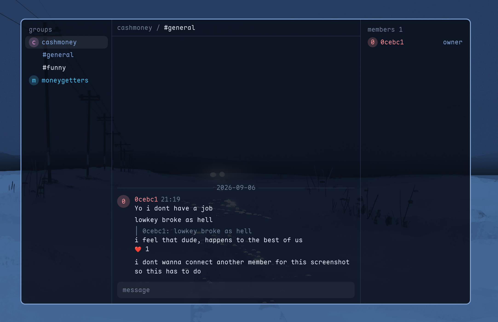

# whimsy

Invite-only e2e messenger.

Only has groups with channels; a DM is a group of two. The server is a dumb relay, it holds
ciphertext for 30 days and knows nothing else. Nobody joins without an invite minted by
whoever runs that server.

C11, Monocypher vendored, no other dependency in the core. The GUI wants SDL3 and FreeType, plus vendored stb image headers.

## Install

    curl -fsSL https://raw.githubusercontent.com/darealhoks/whimsy/main/install.sh | sh

Builds release from source into `~/.local/share/whimsy/src`, installs `whimsy` and
`whimsyd` to `~/.local/bin` and a desktop entry. Re-run it to update.

## Build it yourself

    make                       dev build, -Werror + ASan/UBSan   -> build/dev/
    make MODE=release          -> build/release/

You get `libwhimsy.a`, `whimsyd` (the relay), and `whimsy` (the client, if pkg-config
finds sdl3 and freetype2).

Run a relay and mint yourself an invite:

    whimsyd serve  ~/.local/share/whimsyd 7717
    whimsyd invite ~/.local/share/whimsyd myhost:7717

That prints one single-use url, good for 7 days. Start `whimsy`, paste it, pick a passphrase
(empty keeps a 0600 keyfile instead). Then type `:` to see every command.

## Who knows what

The server sees: ciphertext, mailbox ids, sizes, timing, which account sent, and that one
blob went to several mailboxes.

The server never sees: group ids, sender keys, group state, names

Your disk: always encrypted, argon2id passphrase or a 0600 keyfile (used if you don't put in a password, might add hardware key support later)

Not attempted: hiding your IP or your timing from the server, run it over tor yourself if you really need allat.
No device key sync either; a second device is a second identity, linked to the first.

## The parts

    vendor/monocypher/   crypto, verbatim, not edited
    core/                libwhimsy.a: the only code that touches keys
      wire.c             frame and blob encode/decode
      noise.c net.c      Noise_IK handshake, tcp, framing
      identity.c         seed, keys, fingerprint
      crypto.c           the monocypher wrappers everything else calls
      colour.c           a key's colour, oklch hue from its first byte
      group.c            membership records, sender chains, message crypto
      store.c            encrypted append-only record file
      text.c             utf-8 validate, strip controls, cell width
      whimsy*.c          the public api behind core/whimsy.h
    server/whimsyd.c     epoll relay: register, put, fetch, ack, revoke, invites, ttl sweep
    gui/                 the client: SDL3 window, freetype atlas, panes, commands, markdown

Four places parse untrusted bytes: `wire_decode`, `text_sanitize`, `store_read`, and
Monocypher. Nothing else parses input.

`core/` includes nothing from `server/` or `gui/`. Key material never crosses `whimsy.h`.

## AI disclosure

Fair warning: AI was used to help write this app, if you're not comfortable with that just don't use it. The app is designed to be as secure and private as possible. Severe vulns are unlikely but possible (but thats with any app, with or without AI).

## Licence

MIT, see `LICENSE`. [Monocypher](https://monocypher.org) 4.0.2 under its CC0 option,
`vendor/monocypher/LICENCE.md`; stb headers in `vendor/LICENSES`.
